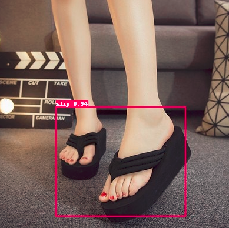
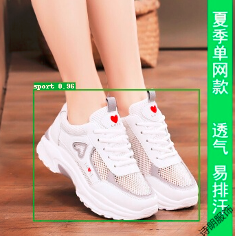
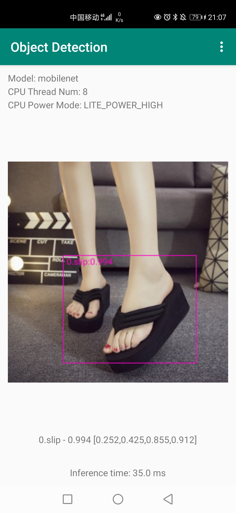

readme

# 拖鞋检测

## 一：项目背景

​	本项目主要是为了利用目标检测的方法识别是否穿拖鞋。目的是为了在一些禁止穿拖鞋的场所进行自动识别入场人员是否穿拖鞋。

## 二：数据集简介

​	本项目使用的数据集是从百度官网爬取的数据集，数据集一共分为两个类别，即穿拖鞋和未穿拖鞋。整个数据集共412张图片，其中训练集351张，验证集51张。

​	数据集进行了预处理，即将所有图片填充到`1024*1024`然后进行标注。这样可以保证网络的输入大小一致，并且图片缩放之后不失真。也可以在数据增强的地方进行填充和缩放。


## 三：模型的选择和开发

### 3.1 模型的选择

​	因为涉及到最终在手机端的部署，所以模型选择轻量化的以mobilenet v1作为backbone的ssd_mobilenet_v1_voc网络。

### 3.2 模型的训练

#### 3.2.1 下载PaddleDetection代码

https://gitee.com/monkeycc/PaddleDetection


使用 github0.5的那个分支 是为了适配手机端的部署，其他版本的PaddleDetection可能会报错


#### 3.2.2 修改参数

修改PaddleDetection/configs/datasets/voc.yml文件中关于数据集的路径

```yaml
metric: VOC
map_type: 11point
num_classes: 3  # 类别数+1（背景类）

TrainDataset:
  !VOCDataSet
    dataset_dir: dataset/VOC_MASK  # 数据集存放位置
    anno_path: train_list.txt    # 训练集
    label_list: label_list.txt   # 标签
    data_fields: ['image', 'gt_bbox', 'gt_class', 'difficult']

EvalDataset:
  !VOCDataSet
    dataset_dir: dataset/VOC_MASK   # 数据集存放位置
    anno_path: val_list.txt    # 验证集
    label_list: label_list.txt  # 标签
    data_fields: ['image', 'gt_bbox', 'gt_class', 'difficult']

TestDataset:
  !ImageFolder
    anno_path: dataset/VOC_MASK/label_list.txt  # 标签文件所在地址
```

参考资料：https://aistudio.baidu.com/aistudio/projectdetail/2223691?pV=448111

#### 3.2.3 开始训练

训练之前将处理好的数据集放进对应位置

训练代码：

```
cd PaddleDetection
python3 -u tools/train.py -c configs/ssd/ssd_mobilenet_v1_voc.yml --eval
```

--eval表示边训练边评估

### 3.3 模型评估

评估代码：

```
python3 tools/eval.py -c configs/ssd/ssd_mobilenet_v1_voc.yml -o weights=output/ssd_mobilenet_v1_voc/model_final.pdparams
```

### 3.4 模型推理

#### 3.4.1 单张图片的推理

```
python tools/infer.py -c configs/ssd/ssd_mobilenet_v1_voc.yml -o weights=output/ssd_mobilenet_v1_voc/model_final.pdparams --infer_img ./00007.jpg --draw_threshold 0.5
```





#### 3.4.2 批量推理

代码：

```
python tools/infer.py -c configs/ssd/ssd_mobilenet_v1_voc.yml -o weights=output/ssd_mobilenet_v1_voc/model_final.pdparams --infer_dir ./image --draw_threshold 0.5
```

### 3.5 总体流程

```
1.获取数据（爬虫获得数据，代码）
2.清洗数据（删除不合理的数据，对齐图片大小，代码）
2.标数据，labelme为每个图像生成json格式的标签数据，利用转换文件将labelme生成的json文件转换为包含所有图片信息的json文件，代码
3.划分数据集（训练集和验证集按照比例划分，最终获得训练集351张，验证集61张，代码）
4.下载paddledetection代码，修改数据读取路径，修改类别信息，修改数据增强方式，修改验证图片大小，修改加载预训练模型的路径
5.训练模型
6.验证结果
7.推理单张图片并可视化（做infer的时候要修改类别，不需要对图片做任何处理，直接在百度下载图片推理即可）
```


## 四：安卓部署

### 4.1导出模型

```
python3 tools/export_model.py -c configs/ssd/ssd_mobilenet_v1_voc.yml -o weights=output/ssd_mobilenet_v1_voc/best_model.pdparams --output_dir ./inference
```

### 4.2 生成推理模型

```
paddle_lite_opt --model_file=inference/ssd_mobilenet_v1_voc/__model__ --param_file=inference/ssd_mobilenet_v1_voc/__params__ --optimize_out=./inference/ssd_mobilenet_v1_voc --optimize_out_type=naive_buffer --valid_targets=arm
```

### 4.3 部署

整个过程可以参考：https://aistudio.baidu.com/aistudio/projectdetail/2223691?pV=448111

### 4.4 效果展示




## 五：总结与升华

### 5.1 学到的知识

1. 如何爬取数据集
2. 如何进行数据清洗
3. 如何进行数据预处理
4. 如何进行数据标注
5. 如何进行数据集转换成VOC和COCO等格式
6. 如何进行数据集划分
7. 模型训练
8. 模型推理
9. Android Studio环境搭建
10. 生成APP

### 5.2 存在问题

​	使用的数据集较少，因为标注数据集需要花费大量时间，主要是实现整个项目的流程，所以检测的MAP较低。另外没有区分拖鞋和凉鞋。

